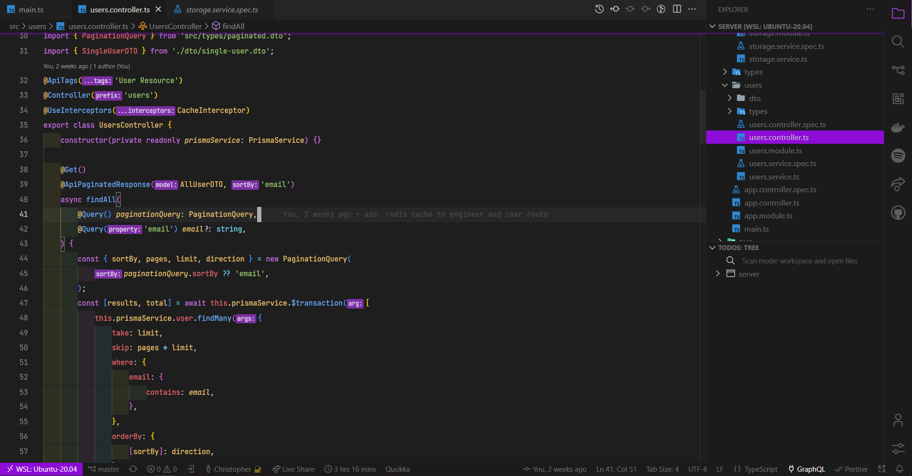

# Dark Purple Relax ☺

Dark vscode theme with relaxing color palette

# Installation

1.  Install [Visual Studio Code](https://code.visualstudio.com/)
2.  Launch Visual Studio Code
3.  Choose **Extensions** from menu
4.  Search for `dark-purple-relax`
5.  Click **Install** to install it
6.  Click **Reload** to reload VsCode
7.  From the menu bar click: Code > Preferences > Color Theme > **Dark Purple Relax**

# Misc

This is my first ever theme, so if you have suggestion or input you can file an issue to [github](https://github.com/zynth17/dark-purple-relax-theme) and do a PR.